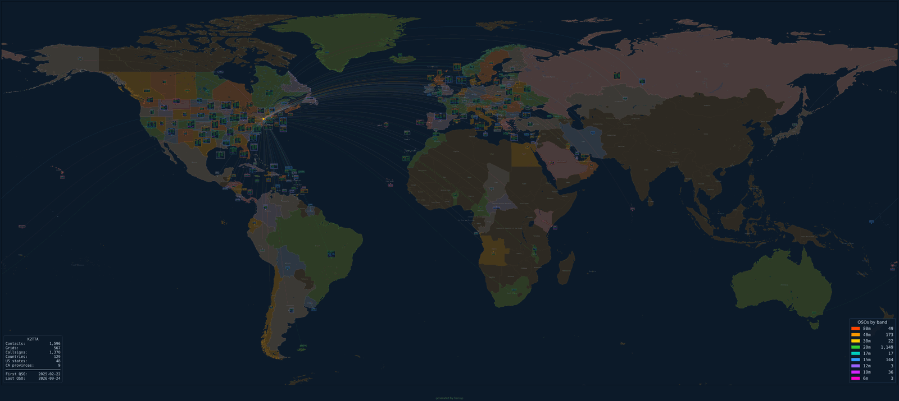
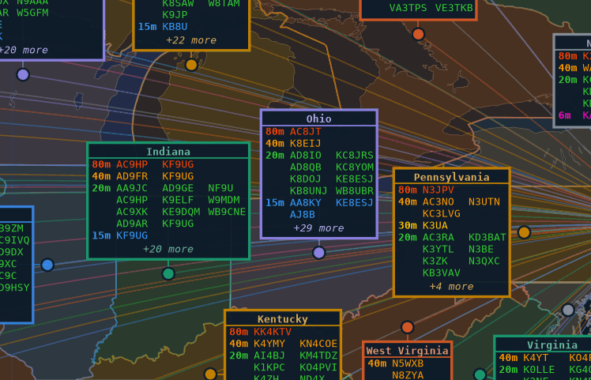
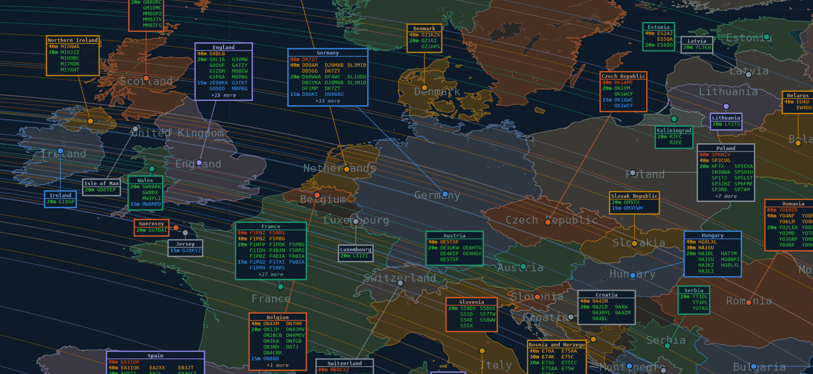
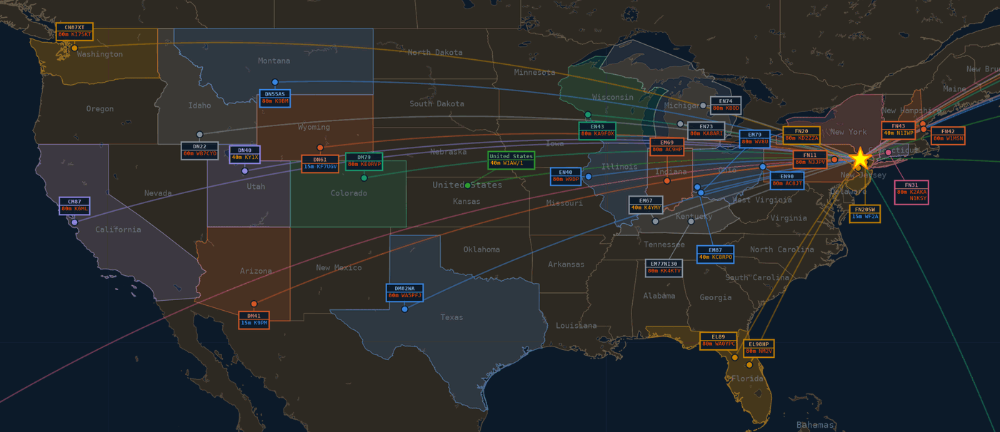
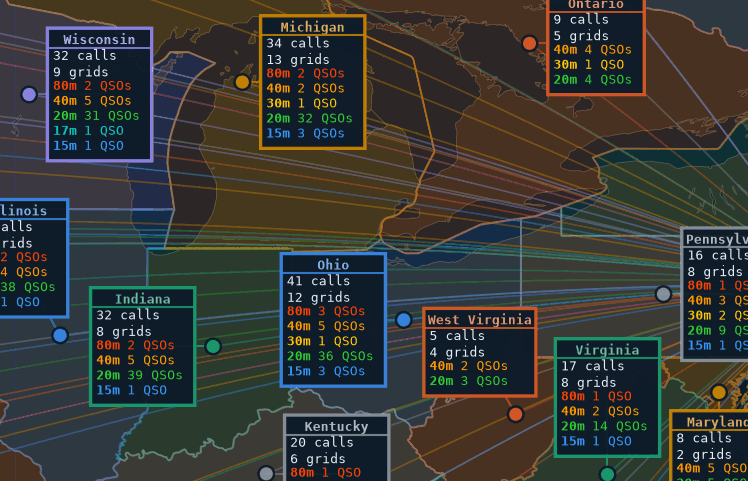
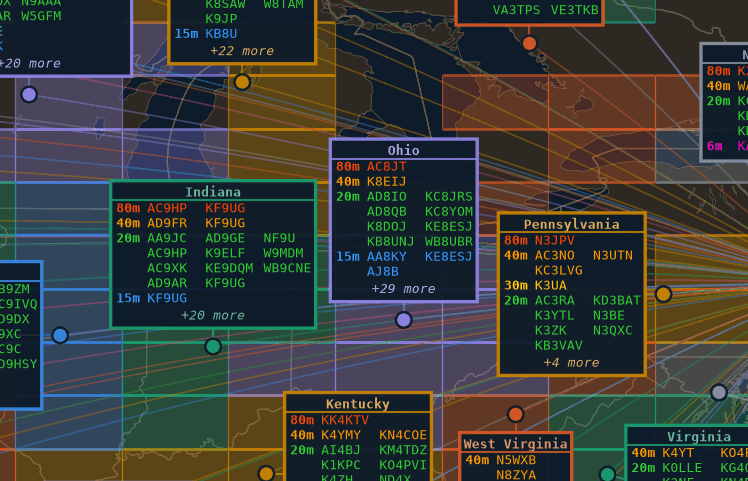
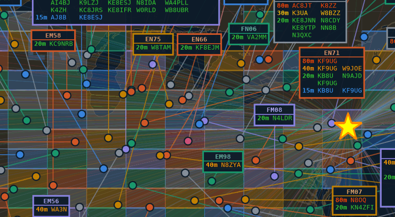
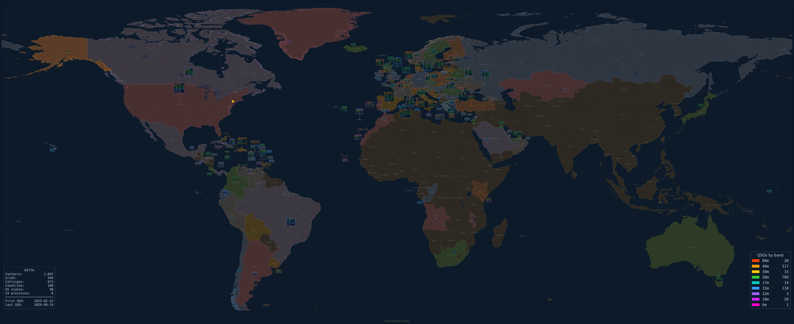
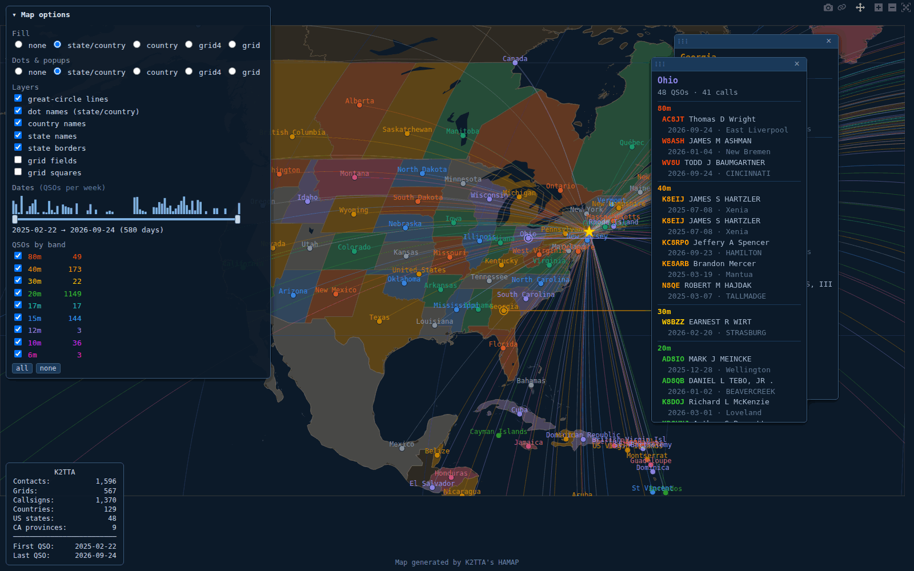
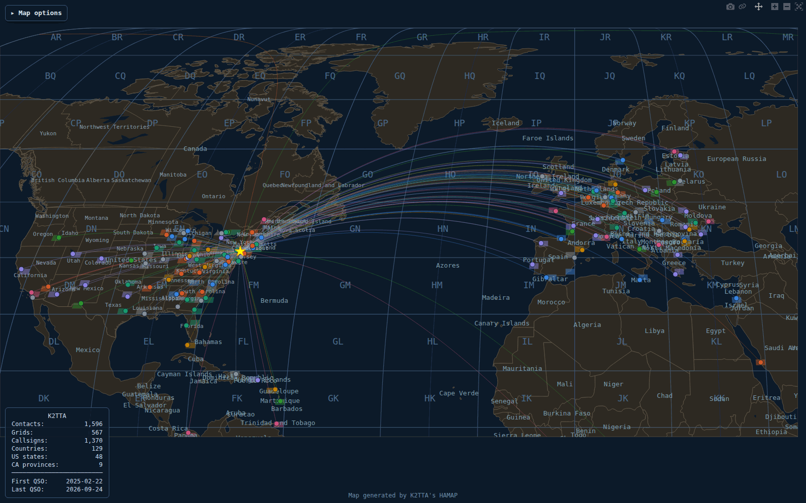

# hamap

Generates an extremely high-resolution world map from an ADIF ham radio contact log.  All map rendering is fully offline once the Natural Earth data has been cached (see [Setup](#setup)).

## Features

- Parses standard ADIF files (produced by WSJT-X, Log4OM, HRD, QRZ Logbook, etc.)
- Places contacts from ADIF LAT/LON, Maidenhead grid squares, or country centroids
- Draws smooth great-circle lines from home station to each contact (when home location is known), correctly split at the date line
- **Info boxes** per grid square, 4-character square, state/province or country, placed automatically around the map (optionally out over open water)
- **Fills** that tint every worked state, country or grid square
- **Colour links what belongs together**: a region's fill, dots, lines and boxes share one colour, and neighbouring regions always differ
- **Profiles** (`small`, `big`, `grids`, `dxcc`, or your own) bundle settings; `auto` picks one from the log size
- **Auto-fit extent** — by default the map is cropped to your contacts plus a margin; `--extent full` shows the whole world (Antarctica included), `--extent poles` the world without polar regions
- **Image mode** — very high-resolution PNG (48 in wide @ 300 DPI ≈ 14 400 px; height follows the map extent), zoomable to read individual callsigns
- **HTML mode** — self-contained interactive map: switch fills, dot units, layers and bands live in the page, pin draggable popups, share views by URL
- `--preview` mode opens the image in an interactive window instead of saving (image mode only)
- Offline-first: map data is cached under `~/.hamap/` after first download

## Examples

All images below come from real logs and are regenerated by [`examples/make_examples.py`](examples/make_examples.py). Full-size PNG output is 14 000–19 000 px wide; the detail images here are **1:1 crops** of it, so this is the size text really is when you zoom in.

**`big` profile** (picked automatically for a 1,600-QSO log): one box per state or country, filled regions, boxes pushed out over open water where the land is crowded.



| Great Lakes / Ohio Valley (1:1) | Europe |
|---|---|
|  |  |

Each box lists callsigns in **band rows**, coloured by band; `+k more` counts the stations beyond the 12 shown.

**`small` profile** (a 43-QSO log): one box per grid, states filled in the same colour as their boxes.



| `--box-calls 0` — summary boxes (1:1) | `--boxes region --fill grid4` — worked squares in each state's colour (1:1) |
|---|---|
|  |  |

**`grids` profile** — every worked 4-character square filled, with the Maidenhead overlay (1:1):



**`dxcc` profile** — LoTW-confirmed QSOs only, one box and fill per DXCC entity:



**Interactive HTML** (`--html`) — switch fills, dot units, layers and bands live; pin draggable popups:

| Panel, state fills, pinned popups | grid4 fill + Maidenhead fields, 40 m only |
|---|---|
|  |  |

To regenerate after a change in the look (needs Pillow and Google Chrome):

```bash
python examples/make_examples.py --small SHORT_LOG.adi --big LARGE_LOG.adi
```

## Install

hamap installs as a command-line tool with [pipx](https://pipx.pypa.io/):

```bash
pipx install .            # from a checkout of this repo
pipx install --force .    # upgrade after pulling changes
```

For development, an editable install picks up source edits immediately:

```bash
pipx install -e .
# or, in a local virtualenv:
python3 -m venv .venv && .venv/bin/pip install -e .
```

## Setup

Pre-download the Natural Earth shapefiles (requires internet, only needed once):

```bash
hamap --setup
```

The data is cached to `~/.hamap/cartopy/` and all subsequent runs work fully offline.

## Usage

```
hamap [FILE] [OPTIONS]

Positional:
  FILE                  ADIF log file to map

Output mode (mutually exclusive, default is image):
  --image               Generate a PNG image (default)
  --html                Generate a self-contained interactive HTML map (Plotly)

Profiles (see "Profiles" below):
  --profile NAME        auto (default), small, big, grids, dxcc, or one from the config file
  --config FILE         Profile config file (default: ~/.hamap/config.ini)
  --show-config         Print effective settings and where each came from, then exit

General:
  --output FILE, -o     Output file path (default: <input>.png or <input>.html)
  --preview             Open image in a window instead of saving (image mode only)
  --my-grid GRID        Home station Maidenhead grid square (e.g. EN82)
  --setup               Download offline map data to ~/.hamap/ and exit

Map content (see "Map Content" below):
  --boxes UNIT          What one info box covers: grid (default), grid4, region,
                        country, or none (dots only)
  --box-calls N         Callsigns per box: all (default); N = the N busiest plus
                        a "+k more" footer; 0 = summary (calls, grids, QSOs per band)
  --band-colors on|off  Colour callsigns by band (default: on); band rows and the
                        band key are shown either way
  --fill UNIT           Tint every worked unit: none (default), grid, grid4,
                        region, country
  --names WHICH         Name labels: none (default), countries, states, all
  --borders WHICH       countries (default), or states to add US state /
                        Canadian province borders
  --grid-lines LEVEL    Maidenhead overlay: none (default), fields (20°×10° lines
                        + labels), squares (also 2°×1° lines)
  --ocean-boxes         Prefer open water for info boxes when it isn't a big
                        detour, freeing land for inland boxes [--no-ocean-boxes]

Great-circle lines:
  --no-lines / --lines  Skip / draw great-circle lines
  --line-alpha A        Opacity 0..1, or auto (default: 0.45 for small logs,
                        fading toward 0.12 as contacts grow)
  --line-width PT       Width in points, or auto (default: 0.8 for small logs,
                        thinning toward 0.4 as contacts grow)

Canvas:
  --dpi N               Output DPI (default: 300)
  --width N             Figure width in inches (default: 48); height follows the extent
  --extent MODE         auto  = fit contacts + home, plus a margin (default)
                        full  = whole world, poles included
                        poles = whole world, polar regions trimmed (60°S–84°N)
  --font-size PT        Info box font size in points (default: 3.0)

Filtering (applied before rendering):
  --confirmed lotw      Only QSOs confirmed via LoTW (LOTW_QSL_RCVD=Y)
  --start DATE          Only include QSOs on or after DATE (YYYY-MM-DD or YYYYMMDD)
  --end DATE            Only include QSOs on or before DATE
  --tail-days N         Only include QSOs from the last N days   [mutually exclusive]
  --tail N              Only use the last N QSOs in the file      [mutually exclusive]

Verbosity:
  --verbose / --debug / --trace
  --logfile FILE        Also write log to FILE
  --syslog              Also send log to syslog
```

### Examples

```bash
# Save a PNG map alongside the ADIF file (default; profile auto picks small/big)
hamap wsjtx_log.adi

# Force a profile, overriding one of its settings
hamap wsjtx_log.adi --profile big --box-calls 20

# What settings will be used, and why?
hamap wsjtx_log.adi --show-config

# Grid-chaser view: every worked 4-char square filled, Maidenhead overlay
hamap wsjtx_log.adi --profile grids

# LoTW-confirmed DXCC entities, one box and fill per country
hamap wsjtx_log.adi --profile dxcc

# One box per state/country, with worked grid squares filled in each state's colour
hamap wsjtx_log.adi --boxes region --fill grid4

# Interactive HTML map (starts in the profile's view; switch live in the page)
hamap wsjtx_log.adi --html
hamap wsjtx_log.adi --html --profile grids   # opens in the grid-square view

# Only QSOs from a specific date range / the last 30 days / the last 500
hamap wsjtx_log.adi --start 2025-01-01 --end 2025-03-31
hamap wsjtx_log.adi --tail-days 30
hamap wsjtx_log.adi --tail 500

# Custom output path
hamap wsjtx_log.adi --output ~/Desktop/contacts.png

# With home station grid square (enables great-circle lines)
hamap wsjtx_log.adi --my-grid EN82

# Whole-world view, larger / higher-resolution image
hamap wsjtx_log.adi --extent full --width 64 --dpi 400

# Just dots and fills: no boxes, no lines
hamap wsjtx_log.adi --boxes none --no-lines
```

## Profiles

A profile is a named set of option defaults. Settings are layered, each overriding the one before:

**built-in defaults → profile (and any profile it extends) → command line**

So `hamap log.adi --profile big --box-calls 20` uses everything from `big` except the box cap. Every on/off option has an "off" form (`--no-ocean-boxes`, `--lines`, …) so the command line can always undo a profile.

| Profile | Settings |
|---------|----------|
| `auto` *(default)* | Picks `small` or `big` after reading the log: `big` at ≥ 300 distinct 4-character grids (counted after filters). |
| `small` | `--boxes grid --fill region --names all --borders states` |
| `big` | `--boxes region --box-calls 12 --fill region --names all --borders states --ocean-boxes --line-alpha 0.40 --line-width 0.4 --width 64` |
| `grids` | `--boxes grid4 --fill grid4 --grid-lines squares --names countries` — a grid-chaser map |
| `dxcc` | `--confirmed lotw --boxes country --box-calls 12 --fill country --names countries --ocean-boxes --no-lines` — LoTW-confirmed DXCC entities |

Run `hamap log.adi --show-config` to see the effective settings, which profile `auto` picked, and where each value came from (`*` marks anything not at its built-in default).

### Custom profiles

Define your own in `~/.hamap/config.ini` (or `--config FILE`). Keys are long option names without the leading dashes; on/off options take `yes`/`no`:

```ini
[defaults]
profile = poster            # used when --profile isn't given (instead of auto)

[profile:poster]
extends    = big            # start from big, then change:
width      = 80
extent     = full
line-alpha = 0.1

[profile:quick]
dpi        = 150
no-lines   = yes
```

A config profile with a built-in's name (`small`, `big`, …) replaces the built-in, and `auto` will use your version. Input/output options (`FILE`, `--output`), `--preview` and `--setup` can't be set in a profile.

## Map Content

Three independent choices decide what is drawn:

| Question | Option | Values |
|---|---|---|
| What does one info box cover? | `--boxes` | `grid`, `grid4`, `region`, `country`, `none` |
| What gets tinted? | `--fill` | `none`, `grid`, `grid4`, `region`, `country` |
| Which reference layers? | `--names`, `--borders`, `--grid-lines` | see [Usage](#usage) |

**Units:** `grid` is the square as logged (usually 6 characters), `grid4` the 4-character square, `region` a US state or Canadian province (other countries as a whole), `country` the ADIF COUNTRY entity (so Alaska and Hawaii are their own). A QSO's state comes from the ADIF `STATE` field, otherwise from its position against the Natural Earth province shapes (with nearest-province matching for positions just offshore or in a lake). QSOs placed only at a country centroid never tint a state.

**Colour links what belongs together.** Everything takes the colour of the *coarser* of the box and fill units: with `--boxes grid --fill region` every grid box in Ohio shares Ohio's colour and tint; with `--boxes region --fill grid4` each state's worked squares are filled in the state's colour; with `--boxes grid4 --fill grid4` each square has its own colour, matching its box. Neighbouring units always get different colours — neighbours are units whose shapes are close (states within ~1.5°, squares that touch) *and* units whose boxes or dots end up close on the page. Colouring is palette-aware: 8 colours checked for contrast on both the ocean and the land, and pairs that look alike (including under red-green colour blindness) are kept off neighbours where possible. `--verbose` reports how many neighbour pairs ended up weakly separated.

**Band lives inside the boxes, never on the map.** Each box lists its callsigns in rows by band, lowest band first (`?` for QSOs without a BAND), with the band label as text and the callsign text in that band's colour; a station worked on two bands appears in both rows. With `--box-calls 0` each row shows that band's QSO count instead. Band text colours are tuned to at least 4.5:1 contrast on the box fill (160 m, 12 m and 10 m are lightened slightly for this). The **QSOs by band** key shows the total per band and doubles as the colour legend.

**Region / country boxes** get one dot at the centroid of the area actually worked (so "Russia" anchors in European Russia when that's where the contacts are) and one great-circle line; grid boxes get a dot per square.

## Large Logs

hamap handles logs with thousands of QSOs, but box placement is ultimately limited by how many pixels each degree of map gets. The `big` profile (picked automatically for large logs) bundles the settings that work best; the individual levers are:

- **`--boxes region`** consolidates boxes by state/province/country (e.g. 568 grid boxes → 184 region boxes); **`--boxes grid4`** groups by 4-character square, usually about 40% fewer boxes than as-logged grids.
- **Go wider.** Canvas width is the biggest lever for placement quality: box text stays the same pixel size, so the map gets more room around each box. On a 1,600-QSO log with region boxes, leader lines were about 30% shorter (in map distance) at 64 in than at 48 in, and about 47% shorter at 80 in. Costs grow with the square of the width — 48 in ≈ 95 MP / 1.2 GB RAM, 64 in ≈ 167 MP / 1.8 GB, 80 in ≈ 261 MP / 2.7 GB — and some viewers (phones, web galleries) downscale or refuse images much past ~200 MP. `big` uses 64.
- **`--box-calls N`** caps box size: `--box-calls 12` lists the 12 busiest callsigns plus "+k more"; `--box-calls 0` replaces the list with a summary (callsigns, grids, QSOs per band).
- **`--ocean-boxes`** moves crowded coastal boxes offshore so inland regions keep room near their dots. A box goes to sea only if its whole rectangle clears land and the open-water spot is no more than 2.5× as far as the nearest free spot of any kind, so boxes with room beside their dot stay put. It works best with region boxes; with grid boxes it tends to build a wall of boxes along coastlines.
- `--line-alpha` / `--line-width` (or `--no-lines`) to tune the great-circle fan.
- `--verbose` prints placement statistics (leader crossings, median / p90 / max leader length) so you can compare settings.

**How boxes are placed.** The most crowded areas go first. Each box searches outward from its dot in rings, hugging the dot edge-to-edge in each direction, and chooses among the free spots of the first few rings by distance plus a penalty for every leader line it would cross. A final pass swaps any two boxes whose leaders still cross (which always shortens the pair) when both still fit. On a 1,600-QSO log in grid mode this cut leader crossings from about 7,900 to about 600 — leaders fan out in parallel bundles instead of criss-crossing — while total leader length went slightly down.

## Interactive HTML Map

`--html` writes one self-contained HTML file: no internet connection or external libraries are needed to open it. Every map unit (grid, grid4, state/country, country) is pre-computed into the file — dots, fill shapes and neighbour-aware colours — so the viewer switches between them live. A 1,600-QSO log makes a file of roughly 9 MB.

### Map options panel

A collapsible panel (top left; click **Map options** to fold it away — the page remembers) controls everything live:

- **Fill** — none, state/country, country, grid4 or grid
- **Dots & popups** — what one dot and its popup cover: none, state/country, country, grid4 or grid
- **Layers** — great-circle lines, dot names (state/country dots), country names, state names, state borders, Maidenhead grid fields and squares
- **QSOs by band** — per-band QSO counts; untick a band to hide its QSOs everywhere (dots, fills, lines and popups), with **all** / **none** shortcuts

Colours follow the same rule as image mode ([Map Content](#map-content)): the coarser of the dot and fill units, with neighbours always distinct. Plain `--html` opens with **Fill = state/country** and **Dots = grid4**. The command-line options (`--fill`, `--boxes`, `--names`, `--borders`, `--grid-lines`, `--no-lines`) and a profile chosen by name (`--profile`, or the config file's default) set the panel's **starting state** instead; image-only options (`--width`, `--dpi`, `--font-size`, `--ocean-boxes`, `--box-calls`) are ignored. `--extent poles` trims the starting view; otherwise the whole world is shown — zoom from there.

### Navigation and popups

- **Scroll / pinch** to zoom, **drag** to pan, the Plotly toolbar (top right) resets the view
- **Hover** a dot for its name and QSO / callsign counts
- **Click** a dot to **pin a popup**: QSOs in band rows (lowest band first), each with callsign and name, date and QTH. (QSO times are deliberately left out of the HTML, since the file is meant to be shared.) Popups follow the band filter live, scroll when long, stay attached to their dot as you pan and zoom (a thin leader and ring mark the dot), can be **dragged** by their title bar to a different spot relative to the dot, and close with **×** or a second click on the dot. Several can be open at once — handy for annotated screenshots.
- The **stats** panel (bottom left) matches the image-mode stats box.

### Shareable views

The page keeps its state in the URL hash, so a view can be bookmarked or shared, e.g.:

```
contacts.html#fill=region&dots=region&view=38,-92,3.2&bands=20m,40m&pin=Ohio,Texas
```

Keys: `fill`, `dots` (unit names as above, `region` = state/country), `bands` (comma-separated, only those shown), `view=LAT,LON,ZOOM` (updated as you pan and zoom), `pin` (dot names to open popups for), `panel=0` (start folded), and `lines`, `labels`, `cnames`, `snames`, `borders`, `gfields`, `gsquares` (`1`/`0`).

## Location Resolution

Contacts are placed on the map in this priority order:

1. **LAT / LON** fields in the ADIF record — ADIF's `XDDD MM.MMM` format (e.g. `N043 31.031`) or plain decimal degrees; all-zero placeholders are ignored
2. **GRIDSQUARE** — Maidenhead locator (4 or 6 characters), converted algorithmically
3. **COUNTRY** — matched against a built-in centroid dictionary (~240 entities)

Contacts with none of the above are skipped with a `[DEBUG]` message.  QRZ Logbook and most modern loggers include LAT/LON or a grid square on nearly every record, so skip rates are typically zero.

## Map Style

- Dark navy ocean, dark warm-sand land, Natural Earth 10 m coastlines and borders
- Dots, lines, boxes and fills coloured to show what belongs together (see [Map Content](#map-content)); dots outlined so they stand out over lines
- Home station shown as a yellow star
- Info boxes: header and border in the unit's colour, callsigns in band rows coloured by band, monospace, sized for zooming (image mode); long rows wrap into columns
- Great-circle lines fade and thin automatically as the number of contacts grows
- Country / state labels skip anything that would overlap a label already drawn (states first, then countries largest-first); micro-states are not labelled
- Stats box (station call, contacts, grids, callsigns, countries, US states, Canadian provinces, first/last QSO date, active filters) and the **QSOs by band** key scale with the canvas and sit in the map corners with the fewest contacts

## Offline Data

All cached data lives under `~/.hamap/`:

| Path | Contents |
|------|----------|
| `~/.hamap/cartopy/` | Natural Earth shapefiles (cartopy cache) |

No API keys, no internet required after `--setup`.

## Dependencies

| Package | Purpose |
|---------|---------|
| `matplotlib` | Figure rendering (image mode) |
| `cartopy` | Geographic projections and Natural Earth features |
| `numpy` | Array operations (pulled in by matplotlib/cartopy) |
| `shapely` | Geometry handling (fills, region lookup, land mask, colouring) |
| `plotly` | Interactive HTML map (HTML mode) |
